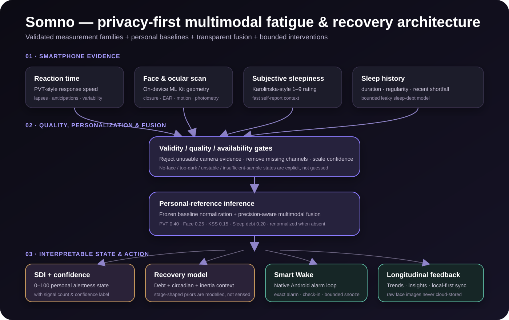

<div align="center">
  
  <h1>Somno</h1>
  <p><strong>Privacy-first multimodal AI for fatigue awareness, recovery modelling and smarter wake decisions.</strong></p>
  <p>
    
    
    
    
    
    
  </p>
</div>

Somno is a smartphone system for understanding fatigue relative to your own alert baseline. It combines reaction-time performance, on-device facial and ocular features, subjective sleepiness and recent sleep history into a transparent **Sleep Deprivation Index (SDI)**, then turns that state estimate into recovery guidance, longitudinal insights and Smart Wake decisions.

Instead of treating sleep as a single number, Somno models fatigue as a changing personal state. The system tracks how your cognition, facial fatigue signals, perceived sleepiness and accumulated sleep shortfall move together over time.

### Android builds

**[Download APK](https://github.com/sushxnthd/somno/releases/download/v27/somno-v27-release.apk)** · **[Download AAB](https://github.com/sushxnthd/somno/releases/download/v27/somno-v27-release.aab)** · **[Somno v27 release](https://github.com/sushxnthd/somno/releases/tag/v27)**

## Product preview

<table>
  <tr>
    <td align="center"><br/><sub><b>Daily state</b></sub></td>
    <td align="center"><br/><sub><b>Explainable SDI</b></sub></td>
    <td align="center"><br/><sub><b>Recovery planning</b></sub></td>
    <td align="center"><br/><sub><b>Smart Wake</b></sub></td>
  </tr>
</table>

## Why Somno

Most consumer sleep products focus on duration, generic sleep goals or wearable-derived stage summaries. Somno focuses on **personal functional state**.

1. **Personal baselines**: current measurements are compared with the same user's calibrated alert state.
2. **Multimodal evidence**: reaction time, facial and ocular features, subjective sleepiness and sleep history contribute complementary information.
3. **Quality-aware inference**: signal quality and availability are evaluated before fusion.
4. **Transparent scoring**: the SDI is built from inspectable features and explicit fusion weights.
5. **Actionable outputs**: recovery planning, trends, alarms and wake check-ins are connected to the same state model.
6. **Privacy-first processing**: facial analysis is performed on-device and raw face images are not retained for cloud sync.

## System architecture

<p align="center">
  
</p>

The pipeline is deliberately modular. Four evidence streams pass through quality control, are interpreted against personal baselines, and are fused into a unified state estimate. That state then drives SDI reporting, recovery modelling, Smart Wake and longitudinal feedback.

For a component-level breakdown, see [`docs/ARCHITECTURE.md`](docs/ARCHITECTURE.md).

## Scientific foundation

Somno is built around measurement families with substantial foundations in sleep, vigilance and fatigue research.

| Research area | Scientific basis | Somno implementation |
|---|---|---|
| **Psychomotor vigilance** | Reaction-time slowing, lapses and response variability are established markers of sleep-loss-related performance change. Brief PVT variants have also been studied for practical use. [Basner, Mollicone & Dinges, 2011](https://pubmed.ncbi.nlm.nih.gov/22025811/) | Short reaction-time probe measuring response speed, lapses, anticipations, variability and time-on-task behavior against a personal baseline |
| **Subjective sleepiness** | The Karolinska Sleepiness Scale is widely used in sleep and fatigue research and has demonstrated relationships with behavioral and EEG indicators of sleepiness. [Kaida et al., 2006](https://pubmed.ncbi.nlm.nih.gov/16679057/) | 1 to 9 KSS input incorporated as an independent subjective state signal |
| **Ocular fatigue markers** | Eyelid closure and ocular behavior have a long research history as indicators of degraded vigilance and fatigue. [Dinges et al., NHTSA](https://rosap.ntl.bts.gov/view/dot/2518) | On-device face detection followed by engineered ocular and temporal features including closure fraction, eye geometry, motion and photometric measurements |
| **Sleep pressure and circadian timing** | Human alertness reflects interacting homeostatic sleep pressure, circadian timing and sleep inertia | Recovery and alertness context combines sleep duration, time awake, circadian structure and post-wake inertia |
| **Sleep loss and athletic performance** | Sleep restriction and sleep deprivation can impair cognitive and physical performance, while sleep-focused recovery can improve readiness. [Gong et al., 2024](https://pubmed.ncbi.nlm.nih.gov/39006249/) [Bonnar et al., 2018](https://pubmed.ncbi.nlm.nih.gov/29352373/) | Reaction-time change, sleep shortfall, subjective fatigue and recovery trends provide a compact personal readiness picture |
| **Shift-work fatigue** | Irregular schedules and restricted recovery opportunities are well-established contributors to fatigue and impaired performance. [CDC/NIOSH](https://www.cdc.gov/niosh/bulletin/2020/fatigue-work.html) | Longitudinal tracking of sleep shortfall, alertness change and recovery across irregular schedules |

### Four-signal fusion

The production SDI combines four evidence channels:

| Channel | Base weight | Role |
|---|---:|---|
| Reaction-time evidence | **0.40** | Highest-weight behavioral signal |
| Facial and ocular evidence | **0.25** | On-device visual fatigue signal |
| KSS subjective sleepiness | **0.15** | Self-reported state |
| Recent sleep debt | **0.20** | Longitudinal sleep-history context |

When a signal is unavailable, the remaining weights are dynamically renormalized. Objective channels also carry precision information based on the usable amount and quality of evidence.

The SDI is centered on the user's own reference state:

`SDI = clamp(50 + 10 × weighted personal-reference z-score, 0, 100)`

This makes the score personal, repeatable and inspectable rather than a generic population threshold.

## Who Somno is for

Fatigue affects far more than students. Somno is designed around human performance across demanding schedules and recovery cycles.

| User group | How Somno can help |
|---|---|
| **Students** | Track sleep loss during exams, compare alertness with personal baseline and plan recovery around demanding study periods |
| **Athletes and high-performers** | Combine sleep shortfall, reaction-time change and perceived fatigue to support day-to-day recovery awareness around training, travel and competition |
| **Drivers** | Use a fast pre-task fatigue check to surface degraded vigilance and accumulated sleep shortfall before long or late-night journeys |
| **Night-shift and late-night workers** | Track alertness changes across irregular schedules, repeated short sleep and difficult circadian windows |
| **On-call professionals** | Quantify the effect of disrupted nights and monitor recovery across irregular duty cycles |
| **Researchers** | Explore a privacy-first mobile architecture for repeated multimodal fatigue and human-performance measurements |

### Athlete recovery

Recovery is not captured by sleep duration alone. An athlete can log sufficient time in bed while still showing slower response speed, elevated sleepiness or an accumulating disruption pattern. Somno brings these signals together in one personal timeline so readiness can be viewed as a dynamic state instead of a single sleep metric.

### Drivers and late-night workers

Fatigue often develops gradually, which makes self-judgment difficult. Somno combines cognitive speed, ocular behavior, subjective sleepiness and recent sleep history into a fast personal check that can make changes in vigilance more visible before demanding tasks.

## AI and modelling stack

Somno's inference stack operates directly on user measurements:

- **Face detection and temporal feature extraction**: Google ML Kit supplies face geometry and detection primitives; Somno derives quality-scored ocular and facial features over a short scan.
- **Personal baseline normalization**: current measurements are converted into within-person deviations from calibrated alert performance.
- **Multimodal evidence fusion**: PVT, face, KSS and sleep-debt signals are combined with availability and precision handling.
- **Sleep-debt modelling**: a bounded longitudinal accumulator tracks recent sleep shortfall and recovery.
- **Recovery-state modelling**: semi-Markov-inspired state priors provide structured recovery context.
- **Decision layer**: SDI, confidence, recent history and alarm state feed recovery guidance and Smart Wake behavior.

The architecture favors transparent, inspectable inference so every major contribution to the final state can be traced back to an observable signal or explicit model component.

## Core capabilities

| Area | Implementation |
|---|---|
| Personal calibration | Frozen baseline workflow with explicit recalibration |
| Reaction-time evidence | Short psychomotor-vigilance-style task with lapse and anticipation handling |
| Facial evidence | On-device ML Kit detection plus temporal and ocular feature extraction |
| Subjective evidence | KSS input |
| Sleep history | Bounded sleep-debt model and sleep-regularity context |
| Fusion | Transparent SDI with missing-signal renormalization and confidence labels |
| Recovery | Recovery-aware guidance and structured recovery-state modelling |
| Smart Wake | Custom Kotlin and Expo native alarm module with exact scheduling, snooze and reboot re-arm |
| Offline behavior | Local-first operation for core check-ins and history |
| Sync | Supabase authentication, database sync, merge rules and deletion tombstones |
| Accessibility | Labels, roles, states, reduced motion, scalable text and accessible controls |
| Data controls | Export and account/data deletion |

## Technology stack

| Layer | Technology | Purpose |
|---|---|---|
| App | React Native + Expo + TypeScript | Typed mobile application layer |
| State | Zustand | Local application state |
| Navigation | React Navigation | Mobile navigation |
| Vision | Expo Camera + ML Kit | On-device face and camera primitives |
| Native Android | Kotlin custom Expo module | Exact alarms, reboot handling, sound, vibration and wake flows |
| Backend | Supabase | Authentication, Postgres and cloud sync |
| Local persistence | AsyncStorage and local stores | Offline-first persistence |
| Release | EAS + Gradle | Android packaging and release builds |

## Repository map

| Path | Purpose |
|---|---|
| `src/engine/` | SDI, debt, alertness, recovery and stage models |
| `src/lib/` | Face scoring, sync, merge, auth and supporting logic |
| `src/screens/` | Production application screens |
| `src/components/` | Reusable UI and accessibility-aware controls |
| `src/store/` | Application state |
| `modules/smart-wake-alarm/` | Custom Kotlin + Expo native alarm module |
| `plugins/` | Expo config plugins |
| `supabase/` | Schema and backend setup |
| `scripts/` | Logic and release test suites |
| `e2e/` | Interaction, journey and visual-flow harnesses |
| `assets/` | Production artwork and UI assets |
| `listing/play/` | Product screenshots and store material |
| `legal/` | Privacy, terms and account-deletion text |
| `docs/` | Architecture and technical documentation |

## Local setup

### Requirements

- Node.js `22.15+` within the supported engine ranges in `.nvmrc` and `package.json`
- npm
- Android Studio and Android SDK for device builds

```bash
npm ci
cp .env.example .env
npm start
```

Somno can run locally without Supabase credentials. To enable accounts and sync, add your own project values to `.env` and apply `supabase/schema.sql`.

```bash
npm run android
```

The Smart Wake module lives in `modules/smart-wake-alarm/`. Expo prebuild and config-plugin processing generate the Android project around it.

## Verification

```bash
npm run typecheck
npm test
npm run check:release
```

The test harness covers alarm logic, alertness, authentication, sleep debt, facial validity, font scaling, PVT behavior, runtime state, recovery modelling, trends, exports, synchronization, merge behavior and release integrity.

GitHub Actions runs type checking, logic tests and release checks for pushes and pull requests.

## Privacy by design

- Raw camera frames are processed transiently on-device.
- Derived numeric facial features are used for scoring and persistence.
- Signal quality and availability are explicit parts of inference.
- Missing modalities are omitted and remaining evidence is renormalized.
- Production credentials, signing keys and `.env` files are excluded from the repository.
- Users can operate locally, export their data and delete their account data.

## Project status

This repository represents the **Somno v27 production-source lineage** used for the Android build. The project has gone through repeated implementation, audit, device-testing and release-readiness cycles across its development history.

## License

No open-source license is granted by this repository unless the project owner adds one explicitly. Third-party dependencies remain subject to their respective licenses.
