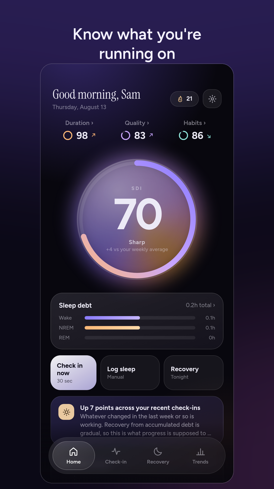
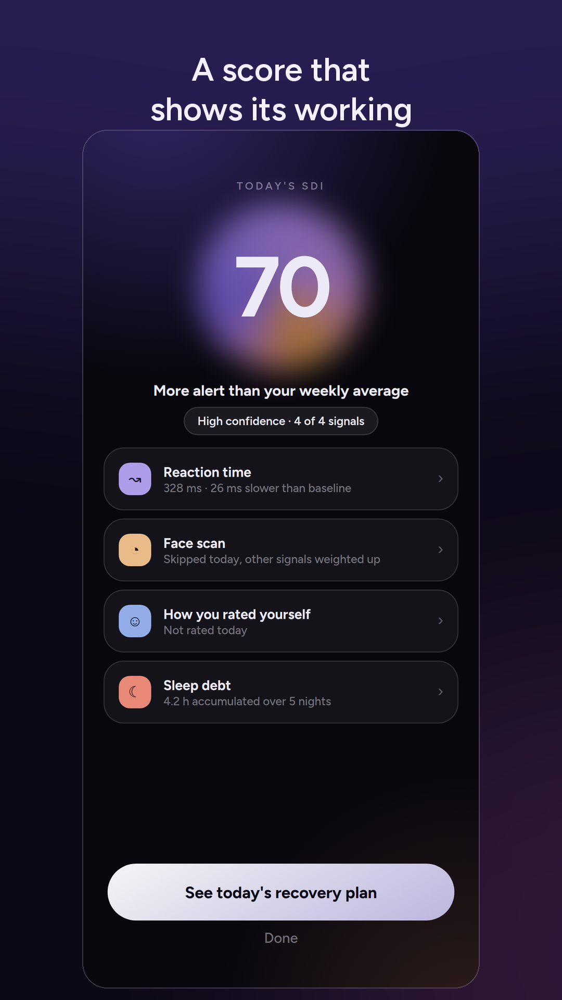
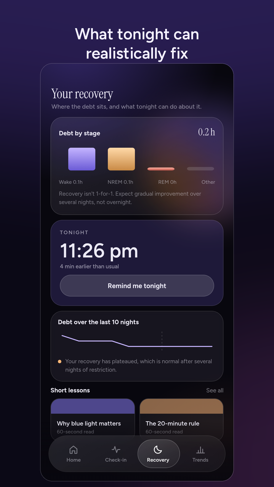
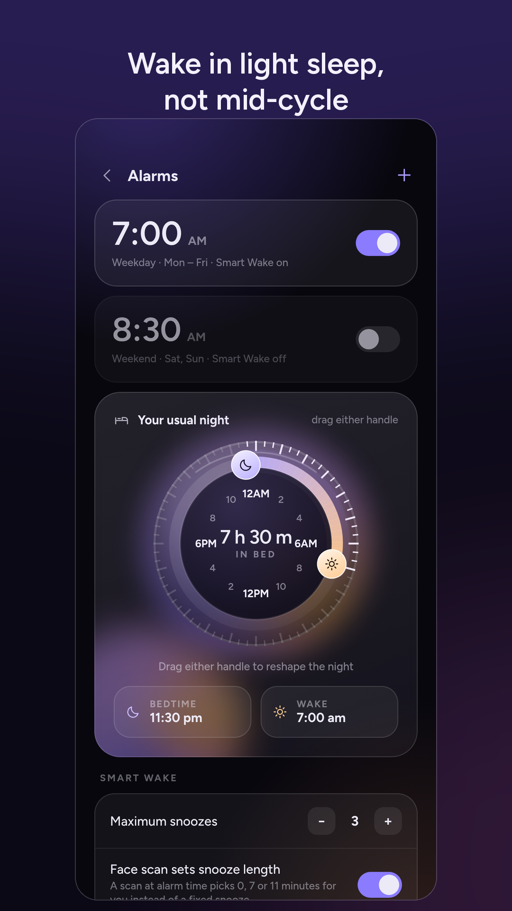

<div align="center">
  
  <h1>Somno</h1>
  <p><strong>Privacy-first multimodal AI for sleep-loss self-assessment and recovery-aware wake decisions.</strong></p>
  <p>
    
    
    
    
    
  </p>
</div>

Somno is a smartphone wellness system built to answer a harder question than *“How many hours did I sleep?”*: **how impaired am I relative to my own alert baseline, and what should I do next?**

It combines a brief reaction-time task, on-device facial/ocular features, subjective sleepiness, and recent sleep history into a transparent **Sleep Deprivation Index (SDI)**. The estimate then feeds recovery guidance, trends, and a guarded Android wake/snooze workflow.

> **Responsible-use boundary:** Somno is an educational/wellness project, not a medical device. It does not diagnose sleep disorders, certify fitness to drive, or claim real-time polysomnographic sleep-stage detection.

### Build artifacts

The competition/release folder contains the installable Android APK and companion build artifacts:

**[Somno v27 builds on Google Drive](https://drive.google.com/drive/folders/1LCeZuJZ3pZdY8xnOJjpHKwOgkAhN6TEX?usp=drive_link)**

## Product preview

<table>
  <tr>
    <td align="center"><br/><sub><b>Daily state</b></sub></td>
    <td align="center"><br/><sub><b>Explainable SDI</b></sub></td>
    <td align="center"><br/><sub><b>Recovery planning</b></sub></td>
    <td align="center"><br/><sub><b>Native Smart Wake</b></sub></td>
  </tr>
</table>

## Why Somno

Most consumer sleep tools emphasize duration or wearable-derived sleep stages. Somno takes a different approach:

1. **Personal reference over generic thresholds** — today is compared with the same user's calibrated alert baseline.
2. **Multiple weak signals over one fragile signal** — behavioral, facial, subjective, and sleep-history evidence can complement one another.
3. **Quality-aware inference** — unusable camera data or missing modalities reduce confidence instead of silently fabricating a measurement.
4. **Action over passive tracking** — the estimate is connected to recovery planning, alarms, check-ins, and longitudinal feedback.
5. **Privacy by architecture** — camera processing is on-device and raw facial frames are not retained for cloud sync.

## What is actually AI/ML here?

Somno is not an API-wrapper chatbot. Its inference stack runs around the user's own measurements:

- **Face detection + engineered temporal features:** Google ML Kit supplies face geometry/detection primitives; Somno derives quality-gated ocular/facial features across a short scan.
- **Personal baseline normalization:** current measurements are interpreted relative to the user's own calibration rather than a population-only score.
- **Multimodal evidence fusion:** PVT, face, KSS, and sleep-debt evidence are fused with explicit availability/precision handling.
- **Recovery modelling:** bounded sleep-debt and semi-Markov-inspired recovery priors provide structured context for recovery guidance.
- **Decision layer:** SDI, confidence, recent history, and alarm state inform bounded wake/snooze actions.

The implementation intentionally favors **transparent, inspectable inference** over an end-to-end black box because the project does not yet have a sufficiently large synchronized human dataset to justify one.

## System architecture

```text
            ┌─────────────── Smartphone inputs ───────────────┐
            │                                                  │
        PVT / RT        Face scan        KSS        Sleep history
            │              │              │              │
            └──────┬───────┴──────┬───────┴──────┬───────┘
                   ▼              ▼              ▼
             validity / quality / availability gates
                              │
                              ▼
                  personal-baseline normalization
                              │
                              ▼
                 transparent multimodal fusion
                              │
                    ┌─────────┴─────────┐
                    ▼                   ▼
             SDI + confidence      debt / recovery prior
                    │                   │
                    └─────────┬─────────┘
                              ▼
                  recovery + wake decisions
                              │
             ┌────────────────┼────────────────┐
             ▼                ▼                ▼
          Trends        Native alarm       Local/cloud
                         workflow              sync
```

For a component-by-component breakdown, see [`docs/ARCHITECTURE.md`](docs/ARCHITECTURE.md).

## Core capabilities

| Area | Implementation |
|---|---|
| Personal calibration | Frozen baseline workflow with explicit recalibration |
| Reaction-time evidence | Short psychomotor-vigilance-style task with lapse/anticipation handling |
| Facial evidence | On-device ML Kit detection + engineered temporal/ocular features + refusal states |
| Subjective evidence | KSS input |
| Sleep history | Bounded leaky sleep-debt model and sleep regularity context |
| Fusion | Transparent SDI with missing-signal renormalization and confidence labels |
| Recovery | Recovery-aware guidance and modelled stage-shaped priors |
| Smart Wake | Custom Kotlin/Expo native alarm module with exact scheduling, snooze, reboot re-arm |
| Offline behavior | Local-first operation; network failure does not break core check-ins |
| Sync | Supabase auth/database, RLS-oriented schema, merge rules and deletion tombstones |
| Accessibility | Labels/roles/states, reduced-motion support, scalable text and accessible controls |
| Data controls | Export and account/data deletion |

## Technology stack

| Layer | Choice | Why |
|---|---|---|
| App | React Native + Expo + TypeScript | Fast cross-platform product iteration with typed shared logic |
| State | Zustand | Small, explicit local state layer |
| Navigation | React Navigation | Production-grade mobile navigation primitives |
| Vision | Expo Camera + ML Kit | On-device face primitives without uploading raw frames |
| Native Android | Kotlin custom Expo module | Alarm scheduling/reboot/full-screen behavior belongs at OS level |
| Backend | Supabase | Auth, Postgres and RLS without a custom server stack |
| Local persistence | AsyncStorage/local stores | Offline-first behavior |
| Release | EAS / Gradle | Reproducible Android packaging |

## Repository map

```text
src/
  engine/              SDI, debt, alertness, recovery and stage models
  lib/                 face scoring, sync/merge, auth and supporting logic
  screens/             production application screens
  components/          reusable UI and accessibility-aware controls
  store/               application state
modules/
  smart-wake-alarm/    custom Kotlin + Expo native alarm module
plugins/               Expo config plugins
supabase/              schema and backend setup
scripts/               focused logic/release test suites
e2e/                   interaction, journey and visual-flow harnesses
assets/                 production artwork and ambient UI assets
listing/play/           product screenshots used for presentation/store material
legal/                  privacy/terms/account-deletion text
docs/                   architecture and competition-facing technical notes
```

## Local setup

### Requirements

- Node.js `22.13+` (see `.nvmrc` / `package.json` engines)
- npm
- Android Studio / Android SDK for device builds

```bash
npm ci
cp .env.example .env
npm start
```

Somno can run locally without Supabase credentials. To enable accounts and sync, add **your own** project values to `.env` and apply `supabase/schema.sql`.

```bash
npm run android
```

The Smart Wake module lives in `modules/smart-wake-alarm/`; Expo prebuild/config-plugin processing generates the Android project around it.

## Verification

```bash
npm run typecheck
npm test
npm run check:release
```

The test harness covers alarm logic, alertness, authentication, sleep debt, facial validity, font scaling/accessibility, PVT behavior, runtime state, recovery/stage modelling, trends, exports, synchronization/merge behavior and release integrity.

A lightweight GitHub Actions workflow runs type checking, logic tests and the release checker for pushes/PRs.

## Privacy and responsible AI

- Raw camera frames are processed transiently and are not intended for cloud storage.
- Low-quality scans produce explicit refusal/error states rather than a believable but unsupported score.
- Missing modalities are omitted and remaining evidence is renormalized.
- Recovery/stage-shaped outputs are **modelled priors**, not sensed sleep stages.
- Production credentials, signing keys and `.env` files are intentionally excluded from this repository.
- Users can operate locally, export their data and request account/data deletion.

## AI YES competition context

This repository is the code-facing evidence package for the AI YES version of Somno. The competition framing emphasizes a **working application**, technical AI design, application engineering, evaluation/testing, UX/accessibility, and responsible AI—not just a research manuscript.

See [`docs/AI_YES.md`](docs/AI_YES.md) for the concise judge-oriented technical summary.

## Project status

This repository represents the **Somno v27 production-source lineage** used for the Android release/capstone build. The project was iterated through repeated design, implementation, audit and device-testing cycles.

## License

No open-source license is granted by this repository unless the project owner adds one explicitly. Third-party dependencies remain subject to their respective licenses.
